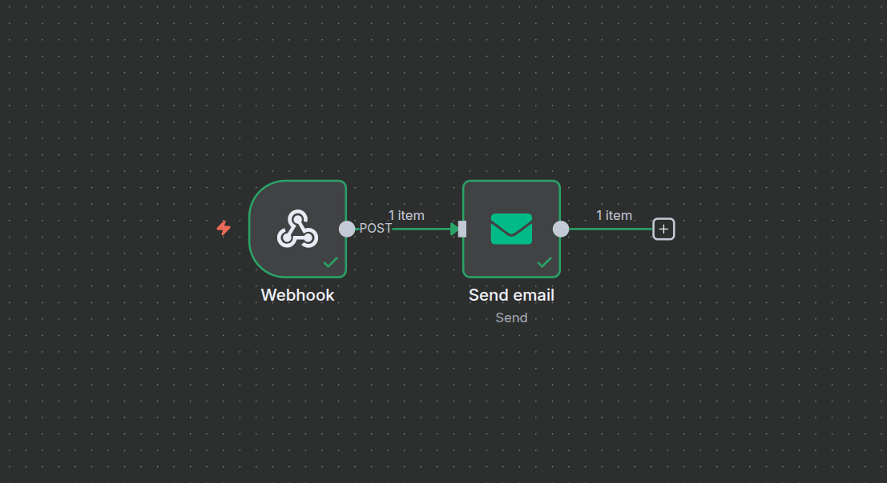

# FitScore App — Mini-MVP

Um sistema simplificado para avaliação de candidatos com **experiência front-end impecável**, persistência de dados e lógica assíncrona para notificações.

---

## 📝 Decisões Técnicas

- **Foco UX**: Maior parte do tempo foi priorizado para garantir a melhor expêriencia do usuário no tempo estabelecido. Badge colorida, animações, feedback visual, estados de loading, mobile-friendly.
- **Next.js + Tailwind + Shadcn**: entrega rápida, responsividade nativa e design moderno, já inclui react hook form!

---

## 🎯 Desafios

- O maior desafio foi **gerenciar o tempo**. Com apenas alguns dias a mais, teria sido possível aprimorar diversas frentes que infelizmente não ficaram prontas a tempo:
  - **Mais fluxos no n8n**, explorando triggers e ações variadas para processos assíncronos mais robustos;
  - **Experiência mobile ainda mais sólida**, garantindo uma interface impecável em todos os tamanhos de tela;
  - **Commits mais organizados e detalhados**, que mostrariam o desenvolvimento linear do aplicativo; sob pressão, o fluxo de trabalho acaba ficando menos linear, com algumas idas e voltas.

---

## 📝 Fórmula do FitScore

- Cada pergunta vale 1 ponto, ver answerKey.ts para **gabarito**.

---

## 🚀 Funcionalidades Implementadas

- Formulário FitScore com 10 perguntas divididas em 3 blocos:
  - **Performance:** experiência, entregas, habilidades
  - **Energia:** disponibilidade, prazos, pressão
  - **Cultura:** valores da LEGAL
- Cálculo automático do **FitScore**
- **Persistência** no Supabase
- **Feedback** visual do FitScore com badge colorida
- **Loading state** e Armazenamento em **local storage**.
- **Dashboard** com listagem de candidatos com Nome, Email, Score e Classificação
- Lógica implementada: **Notificação de candidato**
  - **Trigger**: novo registro no Supabase
  - **Ação**: envio de e-mail com FitScore e classificação

### Arquitetura assíncrona:

**Descrição**: O n8n possui um webhook que fica "ouvindo" requisições. Quando o formulário é enviado e o Supabase faz um POST para esse webhook, o n8n recebe os dados do candidato e dispara automaticamente o e-mail com o FitScore e a classificação.



---

## ⚡ Setup Local

1. **Clonar o repositório**

```bash
git clone https://github.com/seuusuario/fit-score-app.git
```

2. **Instalar dependências**

```bash
npm install
```

3. **Configurar variáveis de ambiente**

```
NEXT_PUBLIC_SUPABASE_URL=""
SUPABASE_SERVICE_ROLE_KEY=""
NEXT_PUBLIC_SUPABASE_ANON_KEY=""
```

4. **Rodar localmente**

```bash
npm run dev
```

---

## 🌐 Deploy

[https://fitscore-mvp.vercel.app](https://fitscore-mvp.vercel.app)

---

## 🎥 Vídeo Demonstrativo

[https://www.youtube.com/watch?v=OjqBaI6OffM](https://www.youtube.com/watch?v=OjqBaI6OffM)

---
